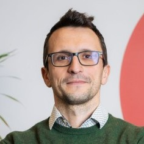

```{css, echo=FALSE}
.pagedjs_page:not(:first-of-type) {
  --sidebar-width: 0rem;
  --sidebar-background-color: #ffffff;
  --main-width: calc(var(--content-width) - var(--sidebar-width));
  --decorator-horizontal-margin: 0.2in;
}
```

```{r, include=FALSE}
knitr::opts_chunk$set(
  results='asis', 
  echo = FALSE
)
library(tidyverse)
library(glue)
source('functions.r') 
```

Aside
================================================================================

{width=70%}

Kontakt {#contact}
--------------------------------------------------------------------------------

- <i class="fas fa-home"></i> Wundtstr. 56, 14057 Berlin
- <i class="fa fa-phone"></i> +49 176 36133214
- `bramucci.alessandro@gmail.com`
- [www.alessandrobramucci.com](https://www.alessandrobramucci.com/)

Sprachkenntnisse {#skills}
--------------------------------------------------------------------------------

```{r}

language_skils <- tribble(
  ~skill,               ~level,
  "Italienisch",              5,
  "Englisch",              4,
  "Deutsch",               4,
  "Spanisch",              1.5, 
)

build_skill_bars(skills = language_skils)

```

IT Kenntnisse
--------------------------------------------------------------------------------

```{r}

skills_data <- tribble(
  ~skill,               ~level,
  "R/RStudio",          4.5,
  "Excel",              3.5,
  "Git/GitHub",         3,
  "Stata",              2, 
  "SQL",                1
)

build_skill_bars(skills = skills_data)
```

Disclaimer {#disclaimer}
--------------------------------------------------------------------------------

<small>
Erstellt mit [pagedown](https://github.com/rstudio/pagedown).   
Quellcode:    
[github.com/Alessandro1984/cv](https://github.com/Alessandro1984/cv).    
Letzte Aktualisierung `r format(Sys.time(), '%d %m %Y')`. 
</small>

Main
================================================================================

Alessandro Bramucci {#title}
--------------------------------------------------------------------------------

### Lebenslauf

---

Geburtsdatum, Ort: 03.11.1984, Ancona (Italien) <br>
Staatsangehörigkeit: italienisch <br>
Familienstand: verheiratet, ein Kind

Beruflicher Werdegang {data-icon=suitcase}
--------------------------------------------------------------------------------

### wissenschaftlicher Mitarbeiter

Hochschule für Wirtschaft und Recht (HWR)

Berlin

Oktober 2019 - August 2022

---

Projekt [„WIPOSIM - Der wirtschaftspolitische Online-Simulator“](https://www.alessandrobramucci.com/project/wiposim/)

::: concise
- Programmierung von Simulationen in R 
- Entwicklung interaktiver Anwendungen mit dem R-Paket *shiny*
- Verfassung von Fachtexten insbesondere zum Thema der Fiskalpolitk
- Umfangreiche Erfahrung in der Datenarbeit mit der *tidyverse* R-Pakete
- Veröffentlichung wissenschaftlichen Artikeln in akademischen Fachzeitschriften
- Einwerbung von Drittmitteln
:::

### wissenschaftlicher Mitarbeiter

Hochschule für Wirtschaft und Recht (HWR)

Berlin

Oktober 2017 - April 2019

---

Projekt [„Modelltheoretische Grundlagen wirtschaftspolitischer Kontroversen“ (MGWK)](https://www.alessandrobramucci.com/project/mgwk/)

::: concise
- Programmierung von Simulationen in R    
- Entwicklung interaktiver Anwendungen mit dem R-Paket *Shiny*    
- Verfassung ausgewählten Kapitel des Buches    
- Übersetzung vom Buch und Simulationen vom Deutschen ins Englische   
- Vorstellung der Projektergebnisse auf wissenschaftlichen Tagungen und Konferenzen   
:::

Lehrerfahrung {data-icon=chalkboard-teacher}
--------------------------------------------------------------------------------

### Lehrbeauftragter

Hochschule für Wirtschaft und Recht (HWR)

Berlin

2016 - 2022

---

- Business Economics (WiSe 2017-18)     
- Economics Tutorium (WiSe 2016-17)     
- International Economics (SoSe 2016, SoSe 2018)    
- Macroeconomics: The Economic Cycle and Employment (SoSe 2016, WiSe 2016-17, SoSe 2017, SoSe 2018, WiSe 2018-19, SoSe 2019)    
- Quantitative Methods for Economists (WiSe 2017-18, WiSe 2018-19, WiSe 2019-20, WiSe 2020-21, WiSe 2021-22)    
- Research Methods Seminar (WiSe 2019-20)     


Studium {data-icon=graduation-cap data-concise=true}
--------------------------------------------------------------------------------

### Promotion in Wirtschaft und Management 

Universität Urbino

Urbino, Italien

2015

### M.A. in International Economics

Hochschule für Wirtschaft und Recht (HWR)

Berlin

2013

### M.A. in Philosophie

Universität Urbino

Urbino, Italien

2010

### B.A. in Philosophie

Universität Urbino

Urbino, Italien

2007

Weiterbildung {data-icon=laptop}
--------------------------------------------------------------------------------

### Programmierkurse (mit Abschlussprüfung)

HWR Berlin / TU Berlin

Berlin

2016 - 2019

- Introduction to Engineering Data Analytics with R (TU Berlin)   
- Applied Data Science for Quality Engineering (TU Berlin)    
- Introduction to Programming in R (HWR Berlin)   
- LaTeX: Einführung in das mathematisch wissenschaftliche Textsatzsystem (TU Berlin)

Ausgewählte Publikationen {data-icon=newspaper}
--------------------------------------------------------------------------------

### Varieties and interdependencies of demand and growth regimes in finance-dominated capitalism: a Post-Keynesian two-country stock–flow consistent simulation approach

Prante, F., Hein, E. und Bramucci, A.

N/A

2022

*Review of Keynesian Economics*, 10(2), 264–290, [https://doi.org/10.4337/roke.2022.02.07](https://doi.org/10.4337/roke.2022.02.07)

### Pluralist macroeconomics - an interactive simulator

Prante, F., Bramucci, A., Hein, E. und Truger, A.

N/A

2020

*International Journal of Pluralism and Economics Education*, 11(1), 55-78, [https://www.doi.org/10.1504/IJPEE.2020.109496](https://www.doi.org/10.1504/IJPEE.2020.109496)

### Decades of tight fiscal policy have left the health care system in Italy ill-prepared to fight the COVID-19 outbreak

Prante, F., Bramucci, A. und Truger, A.

N/A

2020

*Intereconomics*, 55, 147–152, [https://doi.org/10.1007/s10272-020-0886-0](https://doi.org/10.1007/s10272-020-0886-0)

## Referenzen {data-icon="handshake"}

### Prof. Dr. Eckhard Hein, *Hochschule für Wirtschaft und Recht Berlin*

`eckhard.hein@hwr-berlin.de`

N/A

### Prof. Dr. Achim Truger, *Universität Duisburg-Essen* und Mitglied des *Sachverständigenrates zur Begutachtung der gesamtwirtschaftlichen Entwicklung*

`achim.truger@uni-due.de`

N/A

```{js move_disclaim, echo=FALSE}
(function() {
    var pages
    var timer = 0;
    var changeDC = setInterval(function() {
        pages = document.querySelectorAll('.pagedjs_page');
        if(pages.length !== 1 && timer <= 5000) {
            timer += 200;
            return;
        }
        if(pages.length !== 1 && timer > 5000) return clearInterval(changeDC);
        var firstPage = pages[0];
        var lastePage = pages[pages.length - 1];
        var aside = firstPage.querySelector('#aside');
        var asideClone = aside.cloneNode();
        asideClone.id = "aside_last";
        var disclaim = document.querySelector('#disclaimer');
        asideClone.appendChild(disclaim);
        lastePage.querySelector('.pagedjs_page_content > div').appendChild(asideClone);
        clearInterval(changeDC);
    }, 200);
})()
```
